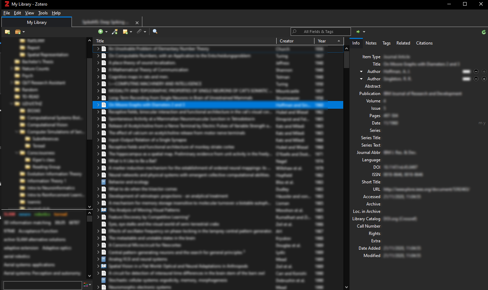

# Zotero Dark Theme

A darker dark theme for Zotero, developed for Windows and aiming to theme as much as possible, including menus, scrollbars, and the PDF viewer.

Inspired by <https://github.com/Rosmaninho/Zotero-Dark-Theme>.

## Installation

Copy the `chrome` folder into your Zotero profile directory
* On Windows - `C:\Users\<User>\AppData\Roaming\Zotero\Zotero\Profiles\<XXXXXXXX.default>\`
* On Linux `~/.zotero/zotero/<XXXXXXXX.default>/`
